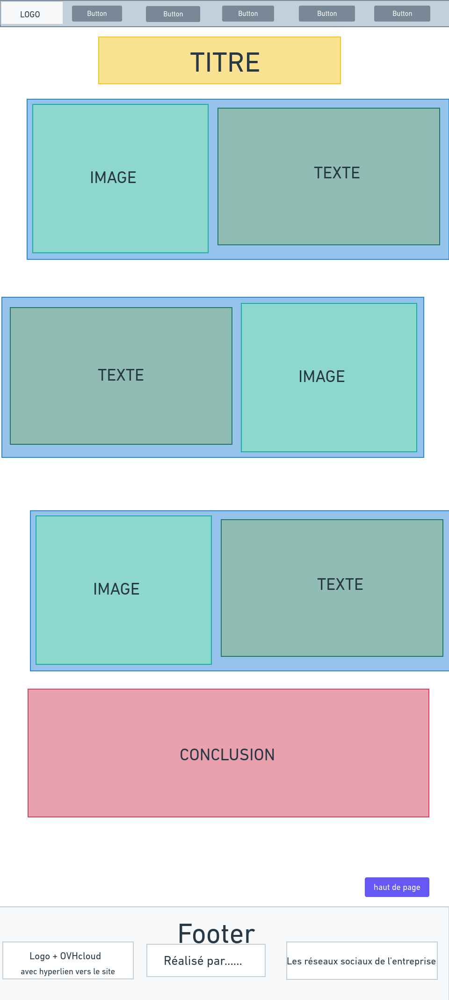

# Présentation OVH SAE_S1.05-06
Projet de création d'un site WEB de présentation de l'entreprise OVH

Groupe 14

Simon BACH Référant  simon.bach02@edu.univ-fcomte.fr

Alexandre LESUR  alexandre.lesur@edu.univ-fcomte.fr

Lenny GRANDJEAN lenny.grandjean@edu.univ-fcomte.fr

Mathias NOTTER  mathias.notter@edu.univ-fcomte.fr

Alban SCHOENFELDER  alban.schoenfelder@edu.univ-fcomte.fr

## Ecran de zoning de l'accueil

## Ecran prototype de l'acceuil

     
 ## Page zoning 
 
 
 ## Page prototype
 
