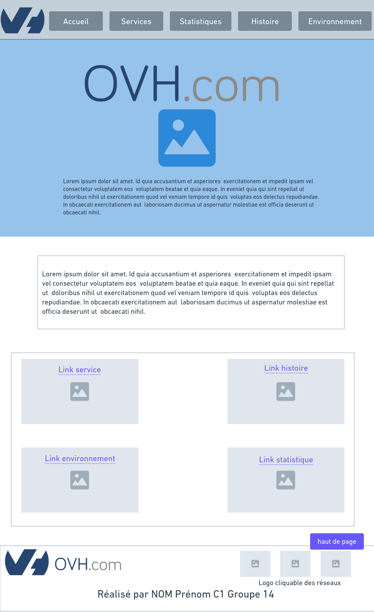

# Présentation OVH SAE_S1.05-06
Projet de création d'un site WEB de présentation de l'entreprise OVH

Groupe 14

Simon BACH Référant  simon.bach02@edu.univ-fcomte.fr

Alexandre LESUR  alexandre.lesur@edu.univ-fcomte.fr

Lenny GRANDJEAN lenny.grandjean@edu.univ-fcomte.fr

Mathias NOTTER  mathias.notter@edu.univ-fcomte.fr

Alban SCHOENFELDER  alban.schoenfelder@edu.univ-fcomte.fr

Nous avons décidé de présenter l'entreprise OVHcloud leader européen du cloud

## Ecran de zoning de l'accueil

## Ecran prototype de l'acceuil

      
 ## Page zoning 
 
 
 ## Page prototype
 
     
Nous avons choisi une barre de menus épuré en haut de la page toujours accessible grâce à un bouton "retour en haut" situé en bas a droite de la page.
L'image en fond et l'animation donne un air moderne a la page d'accueil. La description indique clairement ce que fait l'entreprise. Il peut ensuite scroller pour en savoir plus et les boutons permettent aux visiteurs d'explorer nos differentes pages s'il le souhaite. Les boutons en bas de page permettent aussi au visiteur de partir directement sur la page qu'il souhaite sans avoir à remonter sur la barre de menus. 
Nos pages sont conçues de blocs à droite et à gauche contenant une image et d'un texte. L'image est là pour illustrer et clarifier le texte. Cela aide à la compréhension et permet aussi de réduire le texte.
Le footer est un simple résumé de qui a fait le site et des liens vers le site et les réseaux officiels de l'entreprise OVH.

## Répartition

planning : Alexandre et Lenny

zoning/wireframe : Alexandre Simon

Questionnaire 1: Simon et Alexandre

Questionnaire 2: Simon

Page d'accueil : Alexandre et Lenny(css)

Page histoire : Simon 

Page statistique : Lenny

Page environnement: Mathias

Page services : Alban

Rapport : Alexandre, Lenny, Simon, Mathias, Alban

Diaporama :Alexandre, Lenny, Simon, Mathias, Alban

